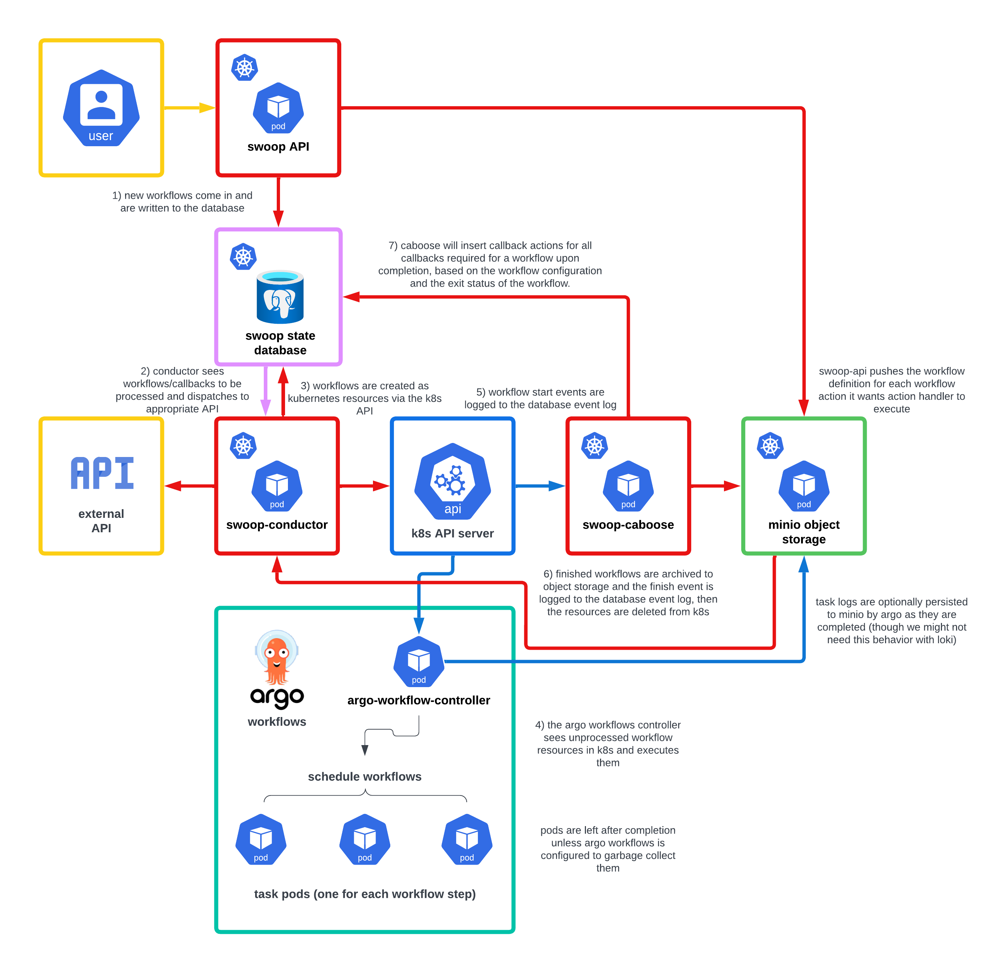

# Overall System Architecture - Architecture Decision Record

## Context

We are building an event-based system with swoop, but current solutions fail to
accommodate user-visible state tracking for all async operations and are
lacking in robustness and error handling. Designing a purpose-built solution
requires detailed consideration to ensure edge cases are adequately handled,
but the result is actually rather straightforward and relatively simple.

## Types of event-triggered async operations

* Workflow executions via various backends, including but not limited to:
  * Argo Workflows – execution in a kubernetes cluster
  * Cirrus – AWS-native orchestration solution
  * Local shell executor – for development/testing
* Callbacks – effectively all webhooks/API calls, but with different types of
  configuration, such as:
  * Summary notification templated from output and workflow state (like final
    status, error messages, etc.)
  * Notification(s) with one or more items, optionally filtering based on
    jsonpath expression
  * Item publishing to STAC API or other downstream services
  * Callbacks to waiting workflows
  * Workflow chaining using entire output payload, optionally filtering items
    based on jsonpath expression

Ideally we are tracking state for all of these operations and can expose to the
user the status of a workflow and any of its subsequent callbacks. We should
also be able to handle retries where possible, and ideally have the ability to
configure a circuit breaker for certain key operation types to reduce
unnecessary retry load.

Some failed operations may also need to be able to be retriggered by admins.

We also need a mechanism by which we can receive events for for workflow start
and end, in particular the latter to allow trigging dependent callbacks per the
workflow final state.

## Some options considered

### Connect the API directly to Argo Workflows/Kubernetes and other downstream services

The simplest option is to have the swoop API call the k8s API to create new
workflow executions. We could have a final step in every workflow to call back
to the swoop API with the workflow state, and that API endpoint would also call
any/all downstream service APIs.

The biggest problem with this approach is that we have no effective way to
retry for errors without pushing the retry semantics onto the caller. This
couples our API to k8s or any external service APIs. In the case of callbacks,
we also end up with no mechanism by which we can retry a specific failing
callback separate from all others. Generally speaking, this is a scaling and
operational nightmare.

### Use a solution like Argo Events

At first glance [Argo Events](https://argoproj.github.io/argo-events/) is a
great solution. It is easy to deploy and configure, and we were able to quickly
spin up a proof-of-concept deployment to queue workflow processing requests,
trigger workflows, and handle workflow state change events.

However, after load testing, we found a few problems with this approach.

* Kubernetes itself is a problem

  Workflows are k8s resources. Too many of them in any state will overwhelm the
  control plane. We can easily mitigate this risk by setting a resource limit
  on workflows, but this means that whatever is creating workflow resources in
  the cluster must handle potential error from k8s when creating a workflow.

  Testing how this would work with Argo Events led to the next observation...

* Argo Events retry handling is lacking key features and is hard to configure

  And maybe doesn't even work. We tried setting it up, but nothing we did
  allowed retries to happen. A single error and workflows we never retried.
  Moreover, we want to consider a certain error a success, and that is unlikely
  to be supported without contributing code changes back upstream. The
  documentation is also lacking/inaccurate. Lastly, retries should support
  circuit breaking, not just rate limiting.

  Events is built on top of NATS, which is supposed to be like a kafka topic,
  conceivably events don't just get dropped. But NATS is a bit of a black box
  to us, has a learning curve, and introduces unnecessary complexity,
  because...

* The state we need to know what workflows need to be created in the cluster is
  already contained in our state database, and workflow states for a workflow
  event updater are part of the workflow resources persisted in the k8s control
  plane

  We don't need another service duplicating all this state. We already have the
  source of truth in these two places. Anything in the middle is just
  unnecessary complexity and a data store that can diverge from our sources of
  truth.

We could have continued looking for more-mature Argo-Events-like solutions, but
the last point above more or less necessitates a custom solution. But such a
solution buys us the ability to ensure we have a straightforward and simple
solution with the operational guarantees we need.

## The proposal: `swoop-conductor` and `swoop-caboose`

We are already using postgres for the swoop state database, and plan to track
workflow states there. If we consider the workflow state model more
generically, we can also use it to track callback states. We can therefore use
postgres as both our state-tracking source-of-truth for all async operations,
but also as a queue/topic for an asynchronous executor without the overhead or
additional complexity of an external solution.

We also have workflow resources in the k8s cluster that have start times, end
times, and statuses. We can use these workflow resources as a source of truth
to sync into our state database. Once they have been sync'd, we can archive
them to object storage and remove them from the cluster.

In this model, swoop in front of the workflow orchestrator becomes two separate
applications: a API application for interacting with the state database, and an
async executor application triggered off async actions inserted into the
database, proposed here as `swoop-conductor`. Behind the workflow orchestrator
we get a single component `swoop-caboose`, to sync the workflow states back
into the state database and insert any post-workflow-completion callback
actions for `swoop-conductor` to process.

### `swoop-conductor`

#### Why not bundle swoop-conductor into the API?

Simply: operational convenience.

Keeping `swoop-conductor` separate from the API means we can shut off new
processing while rolling out updates without taking the API offline. It also
means we can scale API and conductor instances independent of one another.

#### Data model

The basic data model is that "action" rows, which represent processable
objects, have state update "events" tracked in a "thread". That is, events
represent an append-only log of state transitions related to an asynchronous
process, or `action`, and these events are rolled up by their common
`action_uuid` into a single `thread` row, which represents the current state of
the related `action`.

Threads are not managed directly, but are created by an insert trigger on the
`action` table, and updated from an insert trigger on the `event` table. The
"processability" of a thread depends on its current `status` and
`next_attempt_after` time if set (used in the case of error backoff).

To allow scaling and future data retention policies, the `action`, `thread`,
and `event` tables should be paritioned based on the row `created_at`
timestamp.

`action` has a field `action_type`, which can be `workflow` or `callback`. In
the OGC Processes API spec nomenclature, a `job` is an `action` row with a
`action_type = 'workflow'`.

#### LISTEN/NOTIFY

`swoop-conductor` listens for notifications from postgres indicating
processable jobs/callbacks have been created as processable, via a trigger on
the `thread` table. Upon receiving a notification, conductor will wait a
configurable amount of time (for batching) then query the thread table for
processable threads (up to some configurable limit), sorted by priority.

If when querying the returned batch of threads is the same size as the query
limit, an immediate re-query is scheduled. This loop repeats until the batch is
smaller than the query limit. We can also make use of multiple workers to churn
through large batches of messages more quickly (workers should be a
configurable setting).

A conductor instance is configured to listen/query only for certain
`action_names`. Example action names might include `argo_workflows`, `cirrus`,
`webhook`, or `local_executor`. The trigger name tells conductor what action to
take to trigger processing for the thread, how to handle success/failure,
backoff calculation, and circuit-breaking conditions.

#### Querying and row locks

When querying postgres for processable threads, conductor will use advisory
locks to prevent other workers/instances from processing the same threads.
Using advisory locks mean we do not need to keep a transaction open for the
life of the lock; we simply need to make sure we use the same db connection for
all queries from a given `action_type` worker.

Dropped state updates would only occur with this model in the rare case where
conductor dies, has a dropped database connection, or otherwise experiences a
database error between running an action handler and committing the respective
event insert. Such a situation would result in the action being handled more
than once. If at-least-once handling is problematic for a given action, a
action could be set to at-most-once delivery by writing the event update
_before_ handling the action.

In the case of Argo Workflows, we can handle multiple deliveries by using the
`action_uuid` as the workflow resource name, which must be unique within the
k8s cluster.

#### Retry-able errors

In the event of a retry-able error, an action's thread will enter the backoff
state with the `next_attempt_after` timestamp set. As the row going from
not-processable to processable is gated by `next_attempt_after < now()`, no
notification will be triggered to cause conductor to query for that row once it
is again processable. To solve this, conductor will schedule a future query
based on the backoff time when setting the backoff state. Conductor will also
have a polling loop to check the table for backoff events in the next
`backoff_polling_interval`, so it can ensure it has events for all threads in
backoff (helps to prevent needing to schedule future queries past the next
polling interval to limit scheduled events, as well as to assist conductor on
startup to rebuild its operational state).

#### Circuit breaking and rate limiting

We should allow triggers to be configured with both a rate limit and
circuit-breaking patterns. Rate limiting will be implemented as a token bucket,
so we can vary the refill rate of the bucket. If all requests are succeeding,
then we can refill the bucket at the configured rate limit.

In the case of certain errors that meet the circuit-breaking patterns, we will
want to slow down the refill rate of the bucket. For example, if when trying to
submit an Argo workflow we get an error back from kubernetes saying the
resource could not be created due to a quota limit, we want to slow down on
workflow create requests, and in the face of continued errors we can slow down
the refill rate to effectively implement a circuit-breaking backoff.

The current refill rates will not be persisted in any way, so restarts will
reset to the configured refill rates.

#### Action parameters

Conductor will have a configuration for each `action_name` it processes, with
some template configured for API URL and optionally a request body. Some
parameters might come from the application configuration/environment variables,
but many will likely be specific to a given `action`. Each `action` record will
have a `parameters` field of type `jsonb` that will store a set of keys/values
for use in templating the action request.

#### Configuration

`swoop-conductor` is configured via a local file, which can be written to its
pod via a configmap when running in the kubernetes context.

#### Scaling

I propose we write conductor in golang for both ease of implementation as well
as performance. Python, being bounded by a single core, means that scaling
would require multiple instances. go, on the other hand, would allow scaling
both by having multiple instances as well as larger nodes. go is also generally
more performant, meaning it would have higher throughput per unit of CPU than a
python implementation, and would likely require much less memory.

A single instance is also lower load on the database by maintaining less open
connections and running less queries. Under low-throughput conditions every
instance of conductor will receive the same notifications and multiply queries
for processable events unnecessarily, and will register duplicate queries for
backoffs, unless they are configured to monitor different trigger names.

### `swoop-caboose`

Agro runs like this:

1. workflow resource created via the kubernetes API using argo workflow CRD
1. service `argo-workflow-controller`
   1. sees pending workflow resource
   1. processes the workflow config to figure out how to orchestrate the workflow
   1. set the workflow resource to in progress state
   1. runs through the workflow spinning up pods to process the workflow
   1. sets the workflow to completed (or failed or whatever)

That is, at least by default. The workflow resource doesn’t get cleaned up, nor
do the created pods. The `argo-workflow-controller` can do both of those things
if configured properly though. By enabling pod garbage collection we can
make the controller delete completed pods, and to limit the number of
workflow resources we can configure workflow archival to postgres for
completed workflows based on a TTL after completion.

The key point here is that it takes a separate service to remove the workflow
resources from the cluster. This is a trivial process: it is simply a `DELETE`
call to the k8s API. This separate service could be the
`argo-workflow-controller`, but it doesn’t have to be.

Putting this all together, we could write our own service – `swoop-caboose` –
that uses the same informer pattern as `argo-workflow-controller` to listen for
workflow state changes and process them as we need by:

1. pulling the last error message (if failed)
1. archiving the workflow record to object storage (seems to make more sense
   than a postgres database as Argo supports)
1. inserting the events associated with the workflow state changes and the
   associated workflow completion callback actions into the database
1. deleting the workflow resource from the cluster

#### Language choice

We will write this service in golang as well. Doing so will give us better
performance than python and the ability to scale an instance vertically. We
will also be able to import code directly from the Argo Workflows codebase, as
it is implemented in go, saving us development time.

#### Configuration

The service will likely not need any heavy configuration, and as such should be
configurable via environment variables and/or cli flags.

#### Advantages to this approach

* Stateful “queue” via k8s state to allow recovery from errors
* Allows us to process the workflows the way we want
* Clear hook for pulling error logs, which was missing before
* Removes a responsibility from the `argo-workflow-controller`, potentially
  giving it more resources to do things only it can do

#### Disadvantages to this approach

* If the service fails then we will eventually get too many workflows and run
  into our workflow resource quota (but if things are broken, then everything
  running to a halt seems advantageous, actually).
* Scaling: having more than one active instance here seems problematic, unless
  we can find something in the workflow to use as a sharding key and then
  configure the instances accordingly, so they each only process certain
  workflow resources.

## Decision

We are going to build the proposed architecture.

## Consequences

We will have to do more custom development than expected, but we will be
getting the operational guarantees we need to ensure the platform will run the
way we expect.
